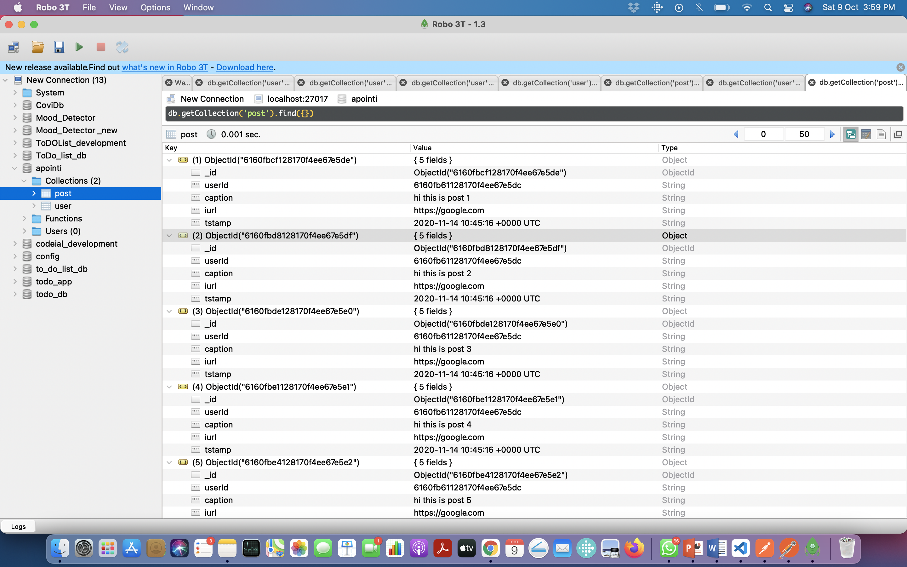

<H1>Hi this madhav</H1>

ENJOY OUR New Backend Service to create your own little Socail Media App.

<a href='https://www.getpostman.com/collections/fe20231cd363ee911317'>
Click Here To Import Post Man Collection</a>  
<a href='https://youtu.be/MKoNW33iSNQ'>Click here to find Demo Video</a>

Endpoints List

<ul>
<li>/users      : to create new user (post)</li>
<li>/users/{id} : to search user by id (get)</li>
<li>/posts      : to create posts (post)</li>
<li>/posts/users/{id}/{pages}:to query post of a particular user and return response by page no (get)</li>
<li>/posts/{id} :to query post by post id (get)</li>
</ul>

<h1>How Pagination Works</h1>

/posts/users/{id}/{pages} in this end point the first param refers to userId and second param refers to pageNo

<h1>User Databse</h1>
</img>

<h1>Post Database</h1>
</img>

<h1>Sample Create User </h1>

<h1>Sample Create A new Post </h1>

<h1>Find User By id </h1>

<h1>Find Post By id </h1>

